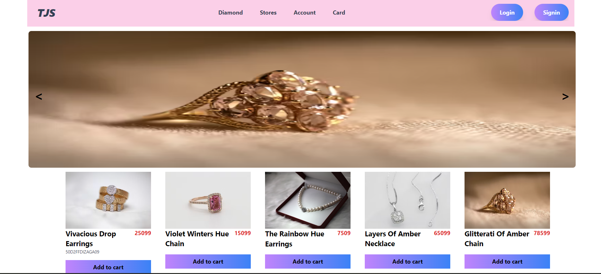

## Overview
This repository contains a Jewelry site  built using React.js for the frontend  The application allows users to browse menus, place order see the list of Product list

## About Jewelry Shop

- ** Project with Shimmer UI Effect, Search bar, Pagination Design in Tailwind CSS

## Tech Stack
### Frontend
- **React.js**: For building the user interface.
- **React Router Dom**: For navigation.

